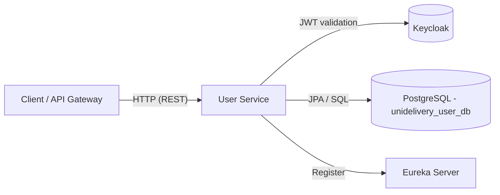
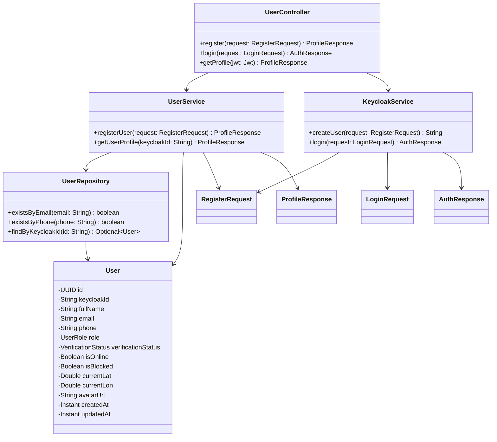

## UniDelivery – User Service

The **User Service** is a Spring Boot microservice in the UniDelivery (Moroccan P2P delivery) platform.  
It is responsible for **user registration, authentication (via Keycloak), and profile management**, and exposes a secured REST API that other services and the API Gateway can consume.

---

## Architecture & Responsibilities

- **Domain focus**
  - Manage UniDelivery users (senders, couriers, receivers).
  - Persist user profiles and status in PostgreSQL.
  - Keep a reference to the Keycloak user (`keycloakId`) for authentication/authorization.
  - Expose basic profile information to other services.
- **Architecture**
  - Spring Boot 4.x (parent `4.0.2`) on **Java 17**.
  - **Eureka client** (`@EnableDiscoveryClient`) to register with the Discovery Service.
  - **OAuth2 Resource Server** validating **JWTs issued by Keycloak**.
  - **Liquibase** for database migrations.
  - **Spring Boot Actuator** for health/info endpoints.

This module follows the UniDelivery project conventions described in the main repository (DTO → Model → Mapper → Repository → Service → Controller).

---

## Tech Stack

- **Language / Runtime**
  - Java 17
  - Spring Boot 4.0.x
- **Frameworks & Libraries**
  - Spring Web MVC
  - Spring Data JPA
  - Spring Security, OAuth2 Resource Server & Client
  - Spring Cloud Netflix Eureka Client
  - Spring Boot Actuator
  - Liquibase
  - MapStruct
  - Lombok
- **Infrastructure**
  - PostgreSQL 17 (or compatible)
  - Keycloak (Identity & Access Management)
  - Netflix Eureka (Service Discovery)

---

## Project Structure

The main Java package is `org.unidelivery.user` and follows this structure:

- `config` – Security and infrastructure configuration (`SecurityConfig`, `KeycloakProperties`, `RestTemplateConfig`).
- `controller` – REST controllers (e.g. `UserController`).
- `dto` – Data Transfer Objects for requests and responses (`RegisterRequest`, `LoginRequest`, `AuthResponse`, `ProfileResponse`).
- `mapper` – MapStruct mapper interfaces (`UserMapper`).
- `model` – JPA entities (`User`, `UserRole`, `VerificationStatus`).
- `repository` – Spring Data repositories (`UserRepository`).
- `service` – Business logic (`UserService`, `KeycloakService`).

Main application entry point:

- `UserApplication` – Bootstraps the service and is annotated with `@SpringBootApplication` and `@EnableDiscoveryClient`.

---

## UML Diagrams

### High-Level Component Diagram



### Core Class Diagram



---

## Domain Model (User)

The core entity is `User`:

- **Identifiers**
  - `id : UUID` – primary key (generated).
  - `keycloakId : String` – ID of the corresponding user in Keycloak.
- **Profile**
  - `fullName : String`
  - `email : String` (unique)
  - `phone : String` (unique, should follow Moroccan `+212` format at the API layer).
- **Status & Role**
  - `role : UserRole` – e.g. COURIER, SENDER (see enum).
  - `verificationStatus : VerificationStatus` – `PENDING`, `VERIFIED`, etc.
  - `isOnline : Boolean`
  - `isBlocked : Boolean`
- **Location**
  - `currentLat : Double`
  - `currentLon : Double`
- **Metadata**
  - `avatarUrl : String`
  - `createdAt : Instant`
  - `updatedAt : Instant`

> Note: domain rules like courier commission, wallets, and tracking coordinates are handled in other dedicated microservices; here we only keep the user-centric data and current location snapshot.

---

## API Overview

Base path: **`/api/users`**

All endpoints return DTOs and never expose JPA entities directly.

- **Register**
  - **URL**: `POST /api/users/register`
  - **Auth**: Public
  - **Request body**: `RegisterRequest`
    - Typical fields: `fullName`, `email`, `phone`, `password`, any required profile data.
  - **Response**: `201 Created` with `ProfileResponse`
  - **Behavior**:
    - Ensures **unique email and phone**.
    - Creates the user in Keycloak via `KeycloakService`.
    - Persists a `User` entity linked to the `keycloakId`.

- **Login**
  - **URL**: `POST /api/users/login`
  - **Auth**: Public
  - **Request body**: `LoginRequest`
    - Typical fields: `username`/`email`, `password`.
  - **Response**: `200 OK` with `AuthResponse`
    - Contains Access Token, Refresh Token, token type, expiry, etc. (as returned by Keycloak).
  - **Behavior**:
    - Delegates to Keycloak’s token endpoint via `KeycloakService.login`.

- **Get Profile**
  - **URL**: `GET /api/users/profile`
  - **Auth**: **Requires Bearer JWT** issued by Keycloak.
  - **Response**: `200 OK` with `ProfileResponse`
  - **Behavior**:
    - Extracts `sub` (subject) from the JWT as `keycloakId`.
    - Loads the corresponding `User` from the database.
    - Returns mapped `ProfileResponse`.

Actuator endpoints:

- **Health**: `GET /actuator/health` (public)
- **Info**: `GET /actuator/info` (public)

---

## Security & Authentication

The service is configured as an **OAuth2 Resource Server**:

- Validates JWT access tokens from Keycloak:
  - `spring.security.oauth2.resourceserver.jwt.issuer-uri`
  - `spring.security.oauth2.resourceserver.jwt.jwk-set-uri`
- Public endpoints: `/api/users/register`, `/api/users/login`, `/actuator/**`.
- All other endpoints require a valid `Authorization: Bearer <token>` header.
- Stateless session management (`SessionCreationPolicy.STATELESS`).

It is also configured as an **OAuth2 client** for communicating with Keycloak for admin operations (e.g. creating users, obtaining tokens).

> For production, never store client secrets directly in `application.properties`; use environment variables or an external config store.

---

## Keycloak Integration

Expected Keycloak setup (local/dev):

- **Realm**: `unidelivery`
- **User Service Client (confidential)**
  - `client-id`: `user-service`
  - Uses `authorization_code` grant for browser flows (if needed).
- **Admin Client**
  - `client-id`: `admin-cli`
  - Has sufficient privileges to create users and manage their credentials.

Key properties (see `src/main/resources/application.properties`):

- `spring.security.oauth2.resourceserver.jwt.issuer-uri=http://localhost:9090/realms/unidelivery`
- `spring.security.oauth2.client.registration.keycloak.client-id=user-service`
- `spring.security.oauth2.client.registration.keycloak.client-secret=...`
- `keycloak.keycloak-server-url=http://localhost:9090`
- `keycloak.realm=unidelivery`
- `keycloak.client-id=admin-cli`

Make sure Keycloak is running and the realm/clients are configured before starting this service.

---

## Database & Migrations

- **Database**: PostgreSQL
  - Default URL: `jdbc:postgresql://localhost:5432/unidelivery_user_db`
  - Default username/password: `postgres` / `postgres` (for local development only).
- **Schema management**: Liquibase
  - Master changelog: `classpath:db/changelog/changelog-master.xml`
  - Initial schema: `db/changelog/changeSets/001-create-users.xml`
- **JPA Configuration**
  - `spring.jpa.hibernate.ddl-auto=validate` (schema must match Liquibase migrations).
  - SQL logging enabled for debugging.

Make sure the database exists and is accessible before running the service.

---

## Eureka (Service Discovery)

This service registers itself in **Eureka**:

- `eureka.client.service-url.defaultZone=http://localhost:8761/eureka/`
- `eureka.client.register-with-eureka=true`
- `eureka.client.fetch-registry=true`
- `eureka.instance.instance-id=${spring.application.name}:${server.port}`

Ensure the Eureka server is running before starting the user-service in a full microservices environment.

---

## Configuration Summary

All core configuration is located in `src/main/resources/application.properties`. For local development, defaults are:

- **Application**
  - `spring.application.name=user-service`
  - `server.port=8081`
- **PostgreSQL**
  - `spring.datasource.url=jdbc:postgresql://localhost:5432/unidelivery_user_db`
  - `spring.datasource.username=postgres`
  - `spring.datasource.password=postgres`
- **Keycloak / OAuth2**
  - `spring.security.oauth2.resourceserver.jwt.issuer-uri=http://localhost:9090/realms/unidelivery`
  - `spring.security.oauth2.client.registration.keycloak.client-id=user-service`
  - (secrets and admin credentials should be overridden via environment variables in non-dev environments)
- **Eureka**
  - `eureka.client.service-url.defaultZone=http://localhost:8761/eureka/`
- **Actuator**
  - `management.endpoints.web.exposure.include=health,info`
  - `management.endpoint.health.show-details=always`

Override any of these values using environment variables or an external configuration system (e.g. Spring Cloud Config) for staging/production.

---

## Running the Service Locally

### Prerequisites

- Java 17+
- Maven 3.9+
- Running instances of:
  - PostgreSQL with database `unidelivery_user_db` created.
  - Keycloak on `http://localhost:9090` with the `unidelivery` realm configured.
  - Eureka server on `http://localhost:8761` (optional but recommended for full stack).

### Build

```bash
mvn clean package
```

### Run

Using Maven:

```bash
mvn spring-boot:run
```

Or using the generated jar:

```bash
java -jar target/user-service-0.0.1-SNAPSHOT.jar
```

The service will start on `http://localhost:8081`.

---

## Testing the API (Local)

1. **Register a user**
   - `POST http://localhost:8081/api/users/register`
   - Body (example):

```json
{
  "fullName": "Test User",
  "email": "test@example.com",
  "phone": "+212600000000",
  "password": "StrongPassword123!"
}
```

2. **Login**
   - `POST http://localhost:8081/api/users/login`
   - Body (example):

```json
{
  "username": "test@example.com",
  "password": "StrongPassword123!"
}
```

   - Copy the `access_token` from the response.

3. **Get profile**
   - `GET http://localhost:8081/api/users/profile`
   - Header: `Authorization: Bearer <access_token>`

4. **Health check**
   - `GET http://localhost:8081/actuator/health`

---

## Development Notes & Conventions

- **Coding Guidelines**
  - Entities use Lombok annotations (`@Data`, `@NoArgsConstructor`, etc.).
  - Services use constructor injection (`@RequiredArgsConstructor`).
  - Controllers never return entities directly; only DTOs.
  - MapStruct mappers use `componentModel = "spring"`.
- **Error Handling**
  - The current implementation uses simple runtime exceptions for duplicate email/phone and missing users.
  - For production, prefer centralized exception handling with consistent error responses.
- **Security**
  - Treat credentials and secrets as **development-only** values.
  - For real deployments, replace them via environment variables, Docker secrets, or a secrets manager.

---

## Future Extensions

- Add Swagger/OpenAPI documentation for all REST endpoints.
- Enforce Moroccan phone number validation (`+212` format) at DTO level.
- Introduce richer role/permission model for couriers, senders, and administrators.
- Integrate with wallet, delivery, and tracking services for richer profile views.

